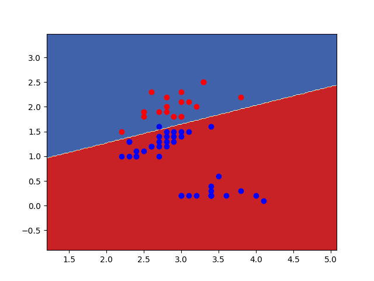

## Results for Question 1

1. 

2. 

3. 

4. Plot for Decision boundry for iris data on Sepal and Petal width
    
    > Accuarcy for split = 0.6 (Train set) is: **0.93** and **0.984**

    > Plot is: 

    >  

    > 

