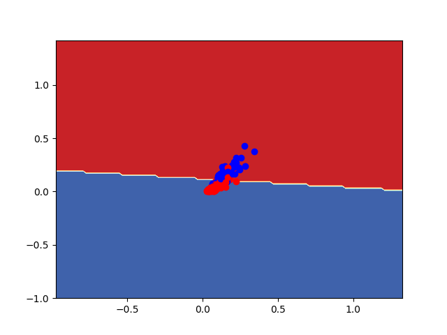

## Results for Question 1

1. **Result for Vectorized Logistic Regression on Breast Cancer Data:** 
    > For Vectorized and Batch size=100 (split=0.6)
        
        > Accuracy for iteration=100 is: 0.9035087719298246
        > Accuracy for iteration=1000 is: 0.956140350877193
        > Accuracy for iteration=2000 is: 0.9605263157894737
        > Accuracy for iteration=3000 is: 0.9649122807017544 
        > Accuracy for iteration=10000 is: 0.9692982456140351 

2. **Result for Autograd Logistic Regression on Breast Cancer Data:**
    >For Autograd and Batch size=300 and autograd (Just considered 6 features due to autograd limit)

        > Accuracy for iteration=100 is: 0.6447368421052632
        > Accuracy for iteration=1000 is: 0.5219298245614035
        > Accuracy for iteration=5000 is: 0.8947368421052632
        > Accuracy for iteration=10000 is: 0.9166666666666666
        > Accuracy for iteration=20000 is: 0.9342105263157895

3. **Plot for Decision boundry for breast cancer data**
    > Using vectorized: 
        > Accuracy (iter=10000,batch=200) is : **0.89**
        > 

    > Using Autograd  :
        > Accuracy (iter=30000,batch=300) is :  **0.794**
        > 

4. **Plot for Decision boundry for iris data on Sepal and Petal width**
    
    > Accuarcy for split = 0.6 (Train set) is: **0.93** and **0.984**

    > Plot is: 

    >  

    > 