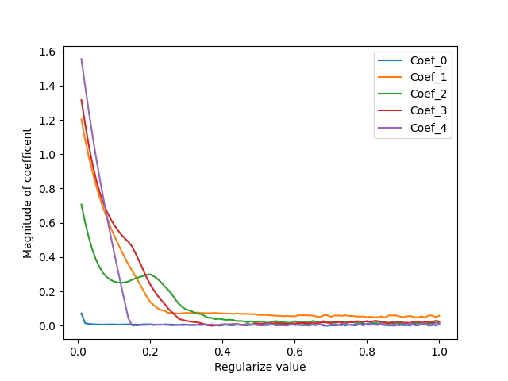

## Results of Question 2: 

1. **Result of L1 Regularization after Nested Cross Validation**

    > Max acuracy for each of 5 folds is:

        > At fold =0:
            Accuracy=1.0 for Regularize Value=0.01
        > At fold =1:
            Accuracy=0.9523809523809523 for Regularize Value=0.01
        > At fold =2:
            Accuracy=0.9523809523809523 for Regularize Value=0.01
        > At fold =3:
            Accuracy=1.0 for Regularize Value=0.08
        > At fold =4:
            Accuracy=0.9047619047619048 for Regularize Value=0.01
        
2. **Resukt of L2 Regularization after Nested Cross Validation**

    > Max acuracy for each of 5 folds is:

        > At fold =0:
            Accuracy=1.0 for Regularize Value=0.01
        > At fold =1:
            Accuracy=0.9523809523809523 for Regularize Value=0.01
        > At fold =2:
            Accuracy=0.9523809523809523 for Regularize Value=0.01
        > At fold =3:
            Accuracy=1.0 for Regularize Value=0.03
        > At fold =4:
            Accuracy=0.9523809523809523 for Regularize Value=0.06
        

3. **Undersatnding Feature Imporatnce**

    > With all Features:

        Coefficent: [ 0.51057262 -0.8012236  -0.27165435  0.71975595  1.09305966]
        Accuracy:   0.9777777777777777

    > Removing feature number: 1

        Coefficent: [-0.14778477 -1.63033358  0.50551009  1.44932395]
        Accuracy:   0.9777777777777777

    > Removing feature number: 2

        Coefficent: [ 0.01362948 -1.40893054  1.27113745  1.52679566]
        Accuracy:   0.9777777777777777

    > Removing feature number: 3

        Coefficent: [ 0.08445059 -0.29475109 -0.78665778  2.36794399]
        Accuracy:   0.9555555555555556

    > Removing feature number: 4
    
        Coefficent: [ 0.04762133 -1.10093689 -0.64476671  1.77144502]
        Accuracy:   0.9555555555555556  
    
    > The graph of Coefficents vs Lambda value is: 

    >
    
    > **Here we can see the Feature importance by the value of coefficent. The less important feature would be close to Zero.**        