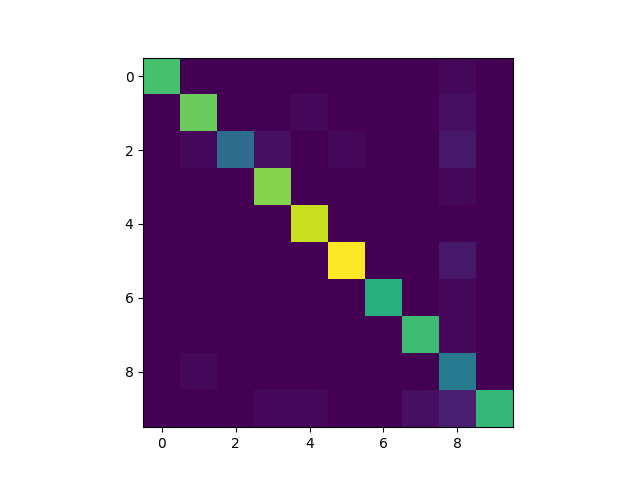
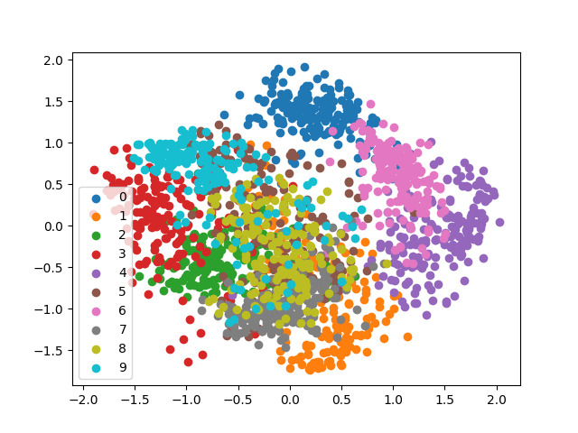

## Results for Question 3

1. **Results for Vectorized Softmax on Digit dataset:**

    > For Vectorized and batch size=100

        > Accuracy for iteration=50 is: 0.9318497913769124
        > Accuracy for iteration=500 is: 0.9749652294853964
        > Accuracy for iteration=1000 is: 0.9735744089012517
        > Accuracy for iteration=2000 is: 0.9749652294853964
        > Accuracy for iteration=5000 is: 0.9749652294853964

2. **Results for Autograd Softmax on Digit dataset:**

    > For Vectorized and batch size=100

        Accuracy for iteration=50 is: 0.9318497913769124
        Accuracy for iteration=500 is: 0.9749652294853964
        Accuracy for iteration=1000 is: 0.9735744089012517
        Accuracy for iteration=2000 is: 0.9749652294853964
        Accuracy for iteration=5000 is: 0.9749652294853964

3. **Stratified KFold results on Softmax**

    > For k=4 folds, (iter=2000,batch=100):

        > Accuracy for all folds: [0.9711111111111111, 0.9621380846325167, 0.9665924276169265, 0.9688195991091314]

4. **Confusion Matrix:**

    > **Image of Confusion Matrix:** 
        
    >

    > The most confused number was 8 with 2,5,9

    > 6 and 0 was less confused

5. **Plotting reduced features of digits**

    >

    > From the plot we can clearly explain the confusion matrix. 
    
    > We can clearly see which digits are more overlapping and which are not. 