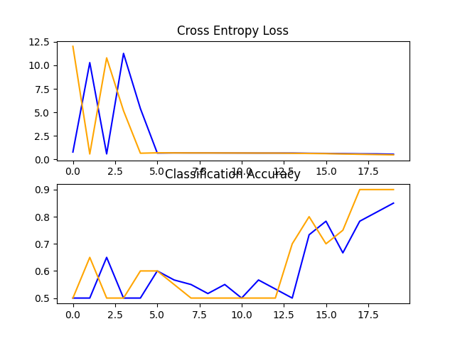

## Here we use CNN to classify images of category Computer and Humans in Images folder

###  The graph for the Loss and Accuracy for VGG1 with and without Augmentation and Transfer Learning are: 

1. **VGG1 graph:**

    >

    > Accuracy: 95 % (epochs=20)

2. **VGG1 graph with Data Augmentation:**

    >

    > Accuracy: 90%  (epochs=20)

3. **Transfer Learning:**

    >

    > Accuracy: 100%  (epoch=5)
